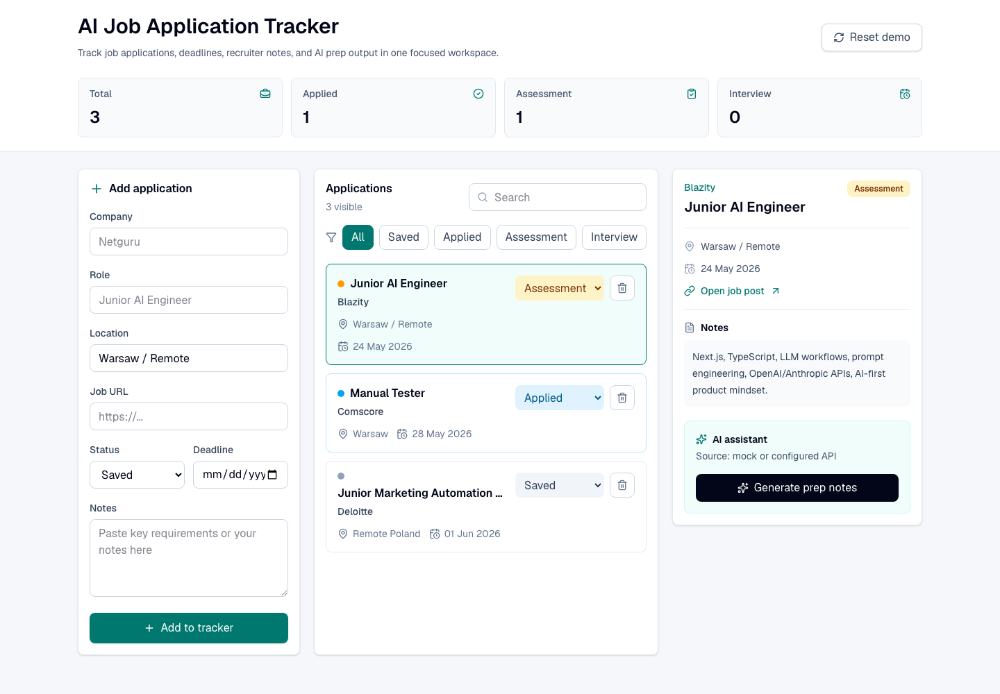
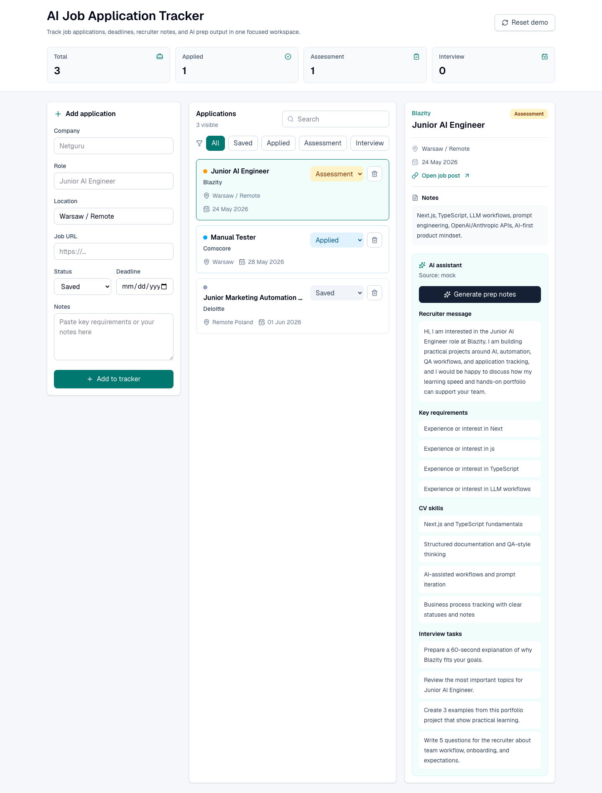

# AI Job Application Tracker

Mini CRM / ATS for tracking job applications, deadlines, statuses, recruiter notes, and AI-assisted interview preparation.

This project was built as an entry-level portfolio showcase for junior AI, QA, project coordination, CRM, and SaaS support roles. It combines a practical job-search workflow with clean UI, TypeScript data modeling, local persistence, QA documentation, and an optional OpenAI-compatible assistant.

## Live Demo

Deployment target: Vercel.

The app is designed to work without environment variables, so the deployed demo can run safely with mock AI responses. Add the live URL here after deployment:

```text
Live Demo: coming soon
```

## Screenshots

### Dashboard



### AI Assistant



## Purpose

The app helps a candidate manage an active job search in one focused workspace:

- save companies and roles
- track pipeline status
- manage deadlines
- keep recruiter notes
- generate interview preparation notes
- keep the workflow demo-friendly without requiring a paid AI API key

## Features

- Add job applications with company, role, location, URL, status, deadline, and notes
- Track statuses: `Saved`, `Applied`, `Assessment`, `Interview`, `Offer`, `Rejected`
- Filter applications by status
- Search across company, role, location, and notes
- Store data in `localStorage`
- View selected application details in a side panel
- Generate AI preparation notes:
  - recruiter message draft
  - key job requirements
  - CV skills to highlight
  - interview preparation tasks
- Use a mock AI response when no API key is configured
- Use an OpenAI-compatible chat completions endpoint when an API key is available
- Include QA test cases and a bug report template in `/docs`

## Tech Stack

- Next.js
- React
- TypeScript
- Tailwind CSS
- localStorage
- OpenAI-compatible API route
- ESLint

## How The AI Fallback Works

The app calls an internal API route:

```text
POST /api/ai-assistant
```

If `OPENAI_API_KEY` is available, the route calls an OpenAI-compatible chat completions API. If no key is configured, it returns a deterministic mock response. This keeps the project safe to deploy and easy for recruiters to test.

## Getting Started

Install dependencies:

```bash
npm install
```

Run the development server:

```bash
npm run dev
```

Open:

```text
http://localhost:3000
```

## Optional AI Setup

The app works without an API key. In that case, the API route returns a mock AI response.

To use a real OpenAI-compatible provider, create a `.env.local` file:

```bash
cp .env.example .env.local
```

Then add your values:

```env
OPENAI_API_KEY=your_api_key_here
OPENAI_BASE_URL=https://api.openai.com/v1
OPENAI_MODEL=gpt-4o-mini
```

Restart the development server after changing environment variables.

## QA Documentation

Manual QA materials are included in `/docs`:

- [Manual test cases](./docs/test-cases.md)
- [Bug report template](./docs/bug-report-template.md)
- [Portfolio copy](./docs/portfolio-copy.md)

Covered areas include adding applications, form validation, filtering, search, status updates, AI mock output, opening job URLs, and demo data reset.

## Deployment Notes

Recommended deployment: Vercel.

Minimal safe deployment:

1. Import the GitHub repository into Vercel.
2. Keep the default Next.js settings.
3. Do not add any API key at first.
4. Deploy and test the mock AI response.

Optional real AI deployment:

1. Add `OPENAI_API_KEY` as a Vercel Environment Variable.
2. Optionally set `OPENAI_BASE_URL` and `OPENAI_MODEL`.
3. Redeploy.

Do not commit `.env.local` or real API keys to Git.

## Project Structure

```text
src/
  app/
    api/ai-assistant/route.ts  API route with real/mock AI logic
    globals.css               Global styles
    layout.tsx                 App metadata and layout
    page.tsx                   Main tracker UI
  lib/
    ai.ts                      AI prompt, mock result, provider call
    sample-data.ts             Demo applications and status styles
  types.ts                     Shared TypeScript types
docs/
  test-cases.md                Manual QA test cases
  bug-report-template.md       Bug report template
public/
  screenshots/                README screenshots
```

## Scripts

```bash
npm run dev
npm run build
npm run lint
```

## Roadmap

- Add task checklist per application
- Add CSV export for applications
- Add basic dashboard metrics such as upcoming deadlines and status distribution
- Add GitHub Actions workflow for lint/build checks
- Add persistent backend storage later, for example Supabase or PostgreSQL

## Security Notes

- No real API keys are committed.
- `.env.local` is ignored by Git.
- `.env.example` contains only safe placeholders.
- AI integration is server-side and optional.
- Mock AI mode keeps the public demo reliable without secrets.

## Why This Project Is Relevant

This project is relevant for junior AI, QA, PM, CRM, support, and automation roles because it combines:

- AI-assisted workflow design
- application pipeline/status tracking
- CRM-like data organization
- QA documentation
- clean README and project structure
- practical TypeScript and API route usage
- safe deployment pattern with mock AI fallback

## CV Description

Built an AI Job Application Tracker using Next.js and TypeScript: a mini CRM for managing job applications, statuses, deadlines, notes, and AI-assisted preparation. Implemented localStorage persistence, an OpenAI-compatible API route with mock fallback, and QA documentation with manual test cases.

## License

This project is licensed under the MIT License. See [LICENSE](./LICENSE).
